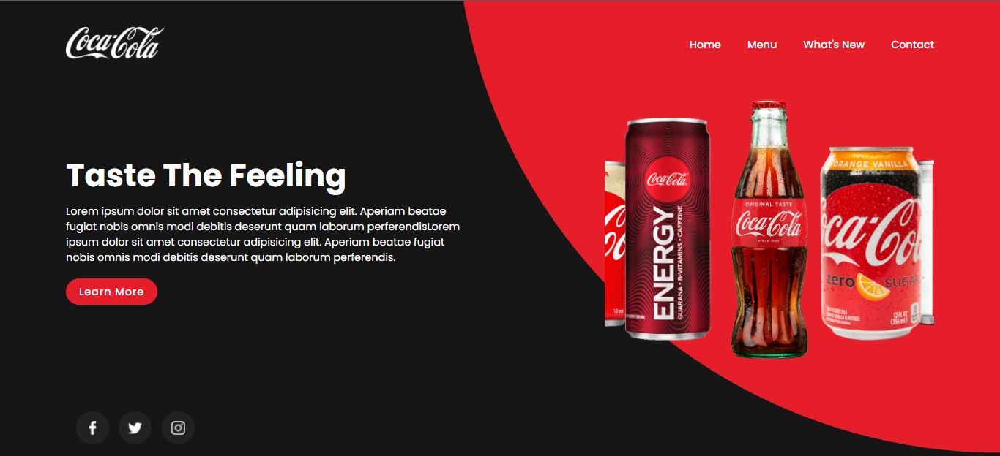

# Coca-cola Website Responsive

- 🐦Project made through the tutorial of the Online Tutorials channel. 

- 🐦Practicing HTML, CSS and JS.

- link do projeto: **https://gcolares95.github.io/Coca-cola-Website-Responsive-/**

 

